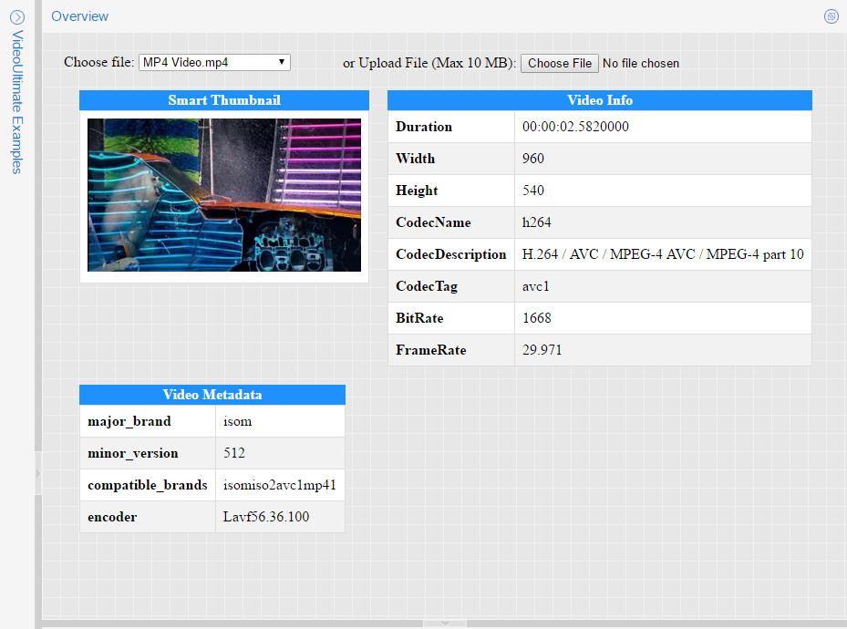

# VideoUltimate: .NET Video Reader and Thumbnailer

VideoUltimate is the fastest and easiest .NET Video Reader and Thumbnailer which can read any video file format on the planet. It supports .NET Core 2.0+ and .NET Framework 4.0+ web/console/desktop applications.

- Read any video file format on the planet.

- Read a video file frame by frame.

- Generate meaningful thumbnails.

- Read info and metadata of the video file.

**Note:** This project contains a fully working version of the product, however without a license key it will run in trial mode. For more information, please see [VideoUltimate: .NET Video Reader and Thumbnailer](http://www.gleamtech.com/videoultimate) product page.

### Live Demo:
https://demos.gleamtech.com/videoultimate/

### Adding references to VideoUltimate assemblies:
https://docs.gleamtech.com/videoultimate/html/adding-references-to-videoultimate-assemblies.htm

### Using VideoUltimate in a project:
https://docs.gleamtech.com/videoultimate/html/using-videoultimate-in-a-project.htm
