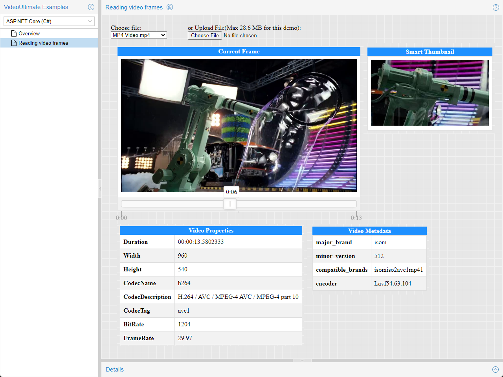

# Video Reader and Video Thumbnailer for .NET

Integrate a video reader and thumbnailer into your .NET application rapidly.

- Read any video file format on the planet.
- Read a video file frame by frame.
- Generate meaningful thumbnails.

<kbd></kbd>

**Note:** This project contains a fully working version of the product, however without a license key it will run in trial mode. For more information, please see [.NET Video Reader and .NET Video Thumbnailer](https://www.gleamtech.com/videoultimate) product page.

### Live Demo:
https://demos.gleamtech.com/videoultimate/

### Adding references to VideoUltimate assemblies:
https://docs.gleamtech.com/videoultimate/html/adding-references-to-videoultimate-assemblies.htm

### Using VideoUltimate in a project:
https://docs.gleamtech.com/videoultimate/html/using-videoultimate-in-a-project.htm

### Showcase videos:

